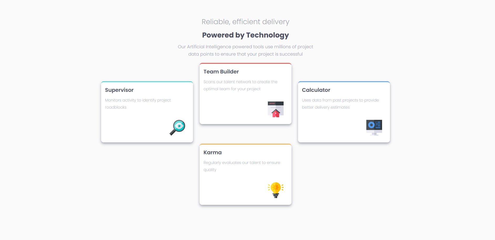

# Frontend Mentor - Four card feature section solution
## Table of contents

- [Overview](#overview)
  - [Screenshot](#screenshot)
  - [Links](#links)
- [My process](#my-process)
  - [Built with](#built-with)

## Overview

### Screenshot

### Links

- Solution URL: (https://github.com/HaseebaAlhaddi/Frontend-Mentor-Four-card-feature)
- Live Site URL: (https://haseebaalhaddi.github.io/Frontend-Mentor-Four-card-feature/)

## My process

### Built with

- Semantic HTML5 markup
- CSS custom properties
- Flexbox
- Grid
